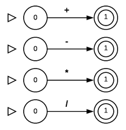

# Implementação de autômato para reconhecimento de cadeias

​	O projeto consiste em implementar um autômato que reconheça expressões aritméticas simples de uma linguagem de programação, onde, essa expressão aritmética é composta por **identificadores** e **operadores aritméticos simples**, no qual devemos desenvolver autômatos separados para cada finalidade. Nos tópicos posteriores será analisado cada autômato por parte, e finalmente, a implementação em *Python*. 

​	Foi utilizado nessa implementação a linguagem de programação *Python*. A linguagem foi utilizada devido as estruturas de dados básicas enriquecidas que facilitou o desenvolvimento do mesmo.


## Autômato dos Identificadores

Os nomes dos identificadores tem por padrão as seguintes regras de escrita: 

- Iniciam com uma letra do alfabeto, seja maiúscula ou minúscula;
- Todos os outros caracteres podem conter letras do alfabeto e números.

Com isso, tem expressão regular do tipo: `[a-zA-Z] . [a-zA-Z0-9]*`. E autômato finito determinístico, sendo `|Q| = 2` e o estado final sendo somente o estado **1**:


Com funções de transição:

- ϛ(0, **a-zA-Z**) = 1
- ϛ(1, **a-zA-Z0-1**) = 1


## Autômato dos operadores aritméticos simples

​	Como os operadores aritméticos são compostos por somente um único símbolo, os autômatos finitos são compostos por um estado inicial (**0**) e um estado final (**1**), com função de transição sendo ϛ(0, **+ | - | * | /**) = 1: 





## Implementação

​	A implementação é composta por três arquivos. O arquivo `input.txt`, no qual será inserido a expressão matemática que será analisada pelo autômato, o arquivo `output.txt` que terá os *tokens* da expressão de entrada após a execução do algoritmo. Já o algoritmo encontra-se no arquivo de nome `automato.py`.

Para exemplificar, inserindo a seguinte expressão no arquivo de `input.txt`:

```txt
a + b - c
a * c - a
a - b * c
```

O arquivo de saída, ou seja, `output.txt` será:

```
<identificador, a>
<soma,>
<identificador, b>
<sub,>
<identificador, c>
<identificador, a>
<mult,>
<identificador, c>
<sub,>
<identificador, a>
<identificador, a>
<sub,>
<identificador, b>
<mult,>
<identificador, c>
```


### Funcionamento do autômato

​	O algoritmo contém uma classe de nome **Autômato**, no qual representa o autômato. O seu construtor recebe:

1. Quantidade de estados (`qtd_estados`);
2. Lista de estados finais (`estados_finais`);
3. Funções de transições em forma de tuplas (estado_atual, lista_alfabeto, próximo_estado).

​	Além disso, a classe tem o método `aceita_cadeia` que recebe cadeia e verifica se essa cadeia pertence ao autômato, retornando `True` e for aceita e `False` se não.


Com isso, foi instanciado o autômato de **identificador**: 

```python
AF_identificador = Automato(2, [1], (0, alfabeto, 1), (1, alfabeto + numeros, 1))
```

Como visto anteriormente, o **identificador** é composto por dois estados, sendo somente o estado **1** final, e as funções de transição: ϛ(0, **a-zA-Z**) = 1 (`(0, alfabeto, 1)`)  e ϛ(1, **a-zA-Z0-1**) = 1 (`(1, alfabeto + numeros, 1)`).

E o autômato das **operações básicas**:

```python
AF_soma = Automato(2, [1], (0, ['+'], 1)) #ϛ(0, +) = 1
AF_subt = Automato(2, [1], (0, ['-'], 1)) #ϛ(0, -) = 1
AF_divi = Automato(2, [1], (0, ['/'], 1)) #ϛ(0, /) = 1
AF_mult = Automato(2, [1], (0, ['*'], 1)) #ϛ(0, *) = 1
```

Após instanciado, basta testar uma cadeia através do método `aceita_cadeia`:

```python
AF_identificador.aceita_cadeia('var')	# True
AF_identificador.aceita_cadeia('6car')	# False
AF_soma.aceita_cadeia('+')				# True
AF_soma.aceita_cadeia('-')				# False
```

